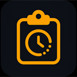
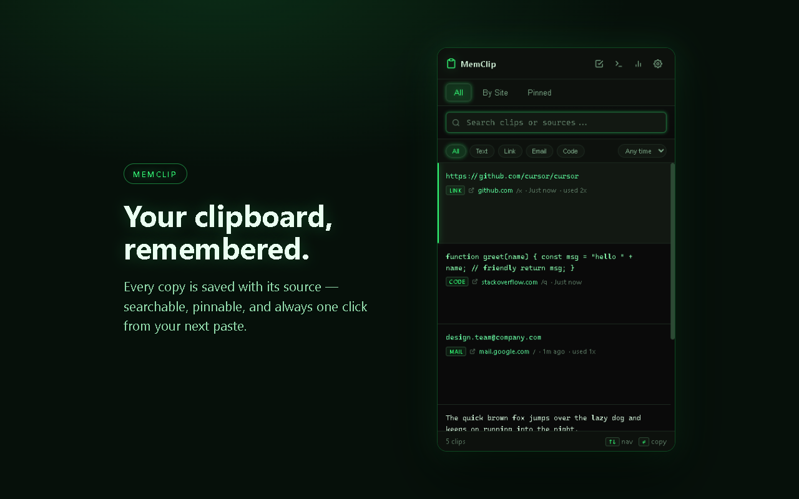
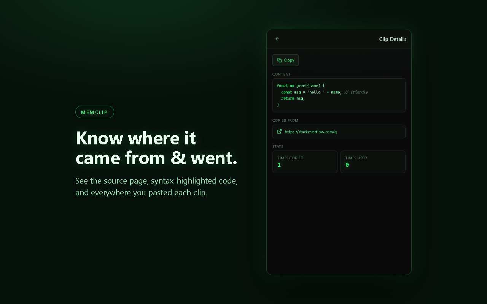
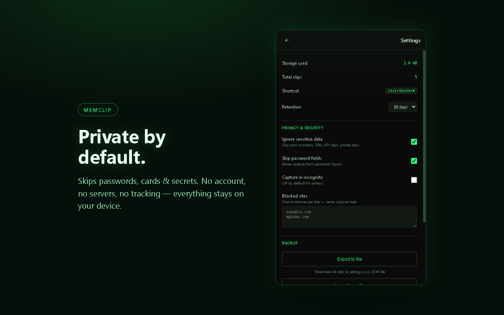

<div align="center">



# MemClip — Clipboard History

**Never lose a copy again.** A private, local clipboard history that remembers what you copied, where it came from, and everywhere you pasted it.

[](manifest.json)
[](PRIVACY.md)
[](PRIVACY.md)
[](LICENSE)

[Website](https://chrismmaldonado.github.io/MemClip/) · [Privacy Policy](https://chrismmaldonado.github.io/MemClip/privacy.html) · [Support](https://chrismmaldonado.github.io/MemClip/support.html)

</div>

---

## What it does

MemClip keeps a searchable history of everything you copy — text, links, emails, and code — and remembers the context around each item: the page you copied it from, when, and every place you later pasted it. Everything stays on your device.

<div align="center">



</div>

## Features

- **Full clipboard history** — automatically saves what you copy on any site, deduped and timestamped.
- **Fast fuzzy search and filters** — find any clip by content, type (text, link, email, code), or date.
- **Source and paste tracking** — see where each clip came from and everywhere you pasted it.
- **Pin and reorder** — keep your go to snippets on top; drag to arrange.
- **Syntax highlighted code** and type aware actions (open links, compose emails).
- **Export and import** — back up or move your whole history as a single JSON file.
- **Keyboard shortcut** — `Ctrl + .` to open instantly (fully customizable).

## Private by design

- **100% local.** No account, no servers, no analytics, no network requests. Your data never leaves your device.
- **Skips common secrets** by default: credit card numbers, SSNs, private keys, and well-known API-token formats (AWS, GitHub, OpenAI, Slack, Google) are skipped before anything is stored.
- **Skips password fields** and incognito windows (opt in if you want it).
- **Per site blocklist** for sites MemClip should never touch.
- Full control: per clip delete, clear history (keep pins), or erase everything.

See [PRIVACY.md](PRIVACY.md) for the full policy.

## Install

Store listings are on the way. In the meantime you can run it unpacked:

1. Download or clone this repository.
2. Open your browser's extensions page and enable **Developer mode**.
3. Choose **Load unpacked** and select the project folder (the one containing `manifest.json`).

Works in Chrome, Edge, Firefox, and Opera (Manifest V3).

## Development

```bash
npm install        # install dev dependencies
npm test           # unit, integration, and manifest tests
npm run test:browser   # real-Chromium checks
npm run build      # produce the distributable zip in dist/
npm run screenshots    # regenerate store screenshots
```

## Project structure

```
manifest.json                 Extension manifest (MV3)
background.js                  Service worker: capture, storage, messaging
content.js                    Copy/paste capture on pages
popup.html / popup.js / popup.css   History UI (search, filters, pins, settings)
_locales/                     Localized strings
icons/                        Extension icons
docs/                         Landing page + privacy + support (GitHub Pages)
store-assets/                 Store screenshots
scripts/                      Build and preview helpers
test/                         Test suites
```

## License

[MIT](LICENSE) © MemClip
